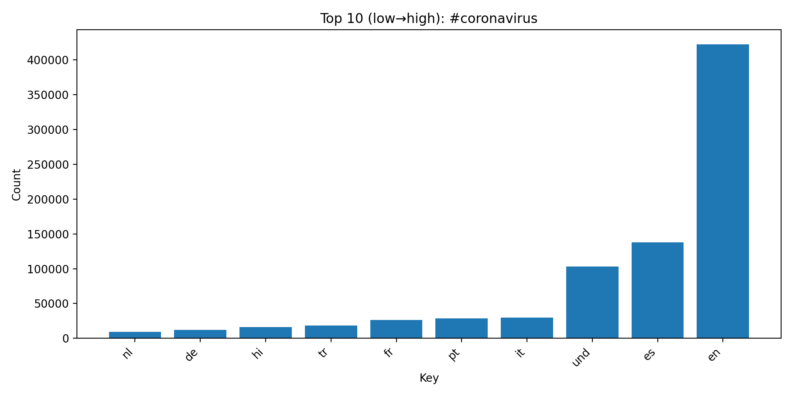
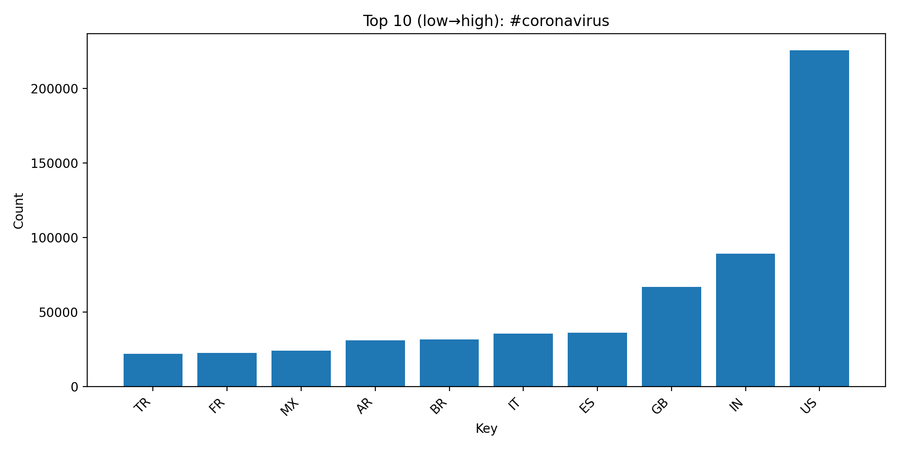
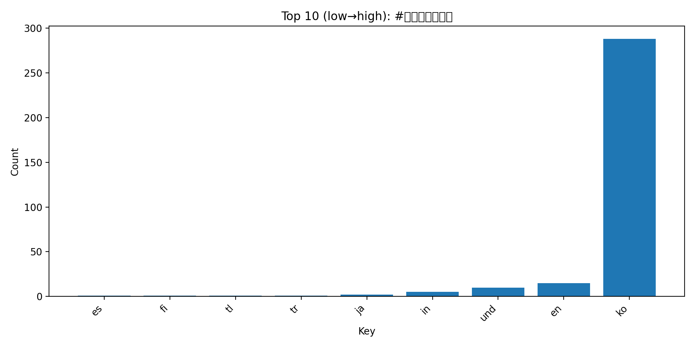
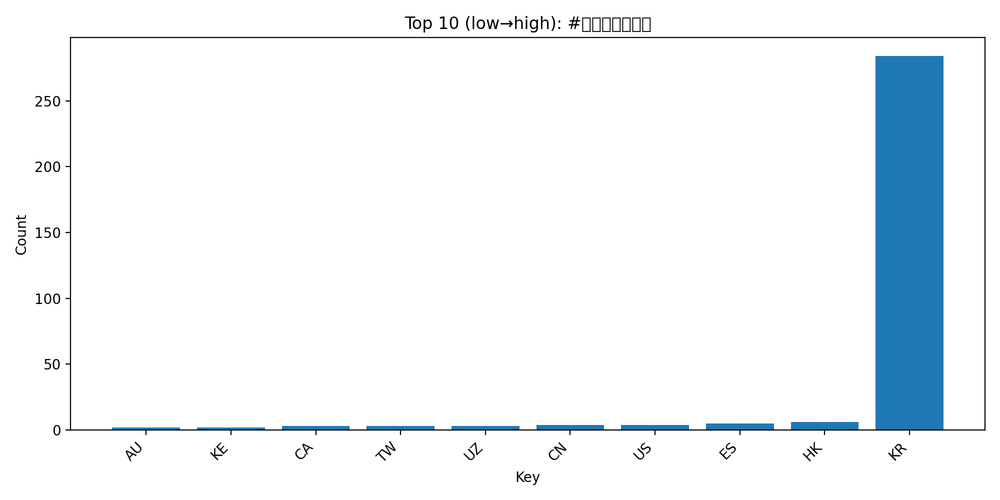
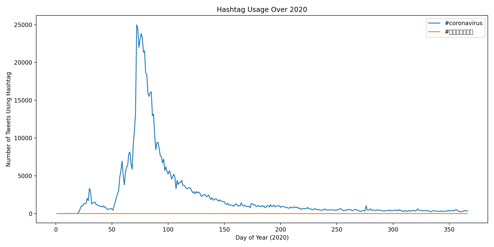

# Global Twitter Coronavirus Hashtag Analysis (2020)
---

## Overview
This project analyzes a large collection of geotagged Twitter data from 2020 to study how different coronavirus-related hashtags appeared across languages and countries. The analysis was implemented using a simplified MapReduce-style pipeline written in Python. The pipeline processes hundreds of compressed Twitter datasets, extracts hashtag information from each tweet, aggregates the results, and generates visualizations of hashtag usage patterns.

---

## Dataset Description
Approximately **500 million tweets** are posted on Twitter each day, and about **2% of those tweets are geotagged**, meaning they include location metadata from the user’s device.

This project uses the Lambda server's `/data/Twitter dataset` collection, which contains **all geotagged tweets from 2020**, totaling approximately **1.1 billion tweets**.

The dataset is organized by day. Tweets for each day is stored in a zip file named `geoTwitter20-MM-DD.zip`, inside each zip file are 24 text files, one for every hour of the  day. Each text file contains a single tweet per line in JSON format. JSON is a popular format for storing data that is closely related to python dictionaries. 

---

## Methodology

The Project consist of three main stages:

**1. Mapping**

Each compressed dataset is processed by `map.py`, which scans  each file for tweets and  counts occurrences of selected hashtags by both language and country. The output of running `map.py` should be two files for every day, one that ends in `.lang` for the language dictionary, and one that ends in `.country` for the country dictionary.

To run `map.py` across all datasets, I created  `run.maps.sh` which loops over every 2020 dataset file and runs the mapper using: 
- `nohup` to allow jobs to continue running after disconnecting
- `&` to execute multiple mapping jobs  at the same time.

**2. Reduce**

After the mapping stage, the `outputs` directory contains the intermediate `.lang` and `.country`  files.These files are aggregated using `reduce.py`, which takes as input the outputs from the `map.py` file and reduces them  by performing element-wise addition of all the counts into global totals across the entire dataset.

This produces two files:
- `all.lang`
- `all.country`

**3. Visualization**

The aggregated data is visualized using Python and the `matplotlib` library  to showcase patterns in hashtag usage. `visualize.py` generates bar charts showing the top 10 languages or countries using the given hashtag.

**4. Time-Series Analysis**

To analyze the hashtag usage over time, `alternative_reduce.py` was implemented. `alternative_reduce.py` scan the mapping outputs and generates a  time-series line plot showing the  daily frequency of the selected hashtags across 2020.

---

## Results and Visualizations

The following visualizations highlight the **top 10 languages and countries** associated with selected coronavirus-related hashtags.

---

### Language Distribution for #coronavirus

This chart shows the top languages in which the hashtag **#coronavirus** appeared. English dominates the dataset, followed by `und` representing an undetermined language then Spanish and Portuguese. This distribution reflects both the global spread of COVID-19 and the large number of English-language Twitter users.

---

### Country Distribution for #coronavirus

This visualization shows the countries generating the largest number of tweets containing **#coronavirus**. Countries with high Twitter usage and large populations appear most frequently in the dataset (United States, India, Great Britian)

---

### Language Distribution for #코로나바이러스

This chart displays the language distribution of tweets containing the Korean hashtag **#코로나바이러스**. As expected, the majority of tweets appear in Korean, though other languages also appear assuming due to international discussions of the pandemic.

---

### Country Distribution for #코로나바이러스

This visualization highlights the countries where the Korean hashtag **#코로나바이러스** was used most frequently. The majority of these tweets originate from South Korea, with much smaller contributions from other countries.

---

### Hashtag Usage Over Time

This time-series view provides insight into how social media discussions intensified during major moments in the pandemic.
